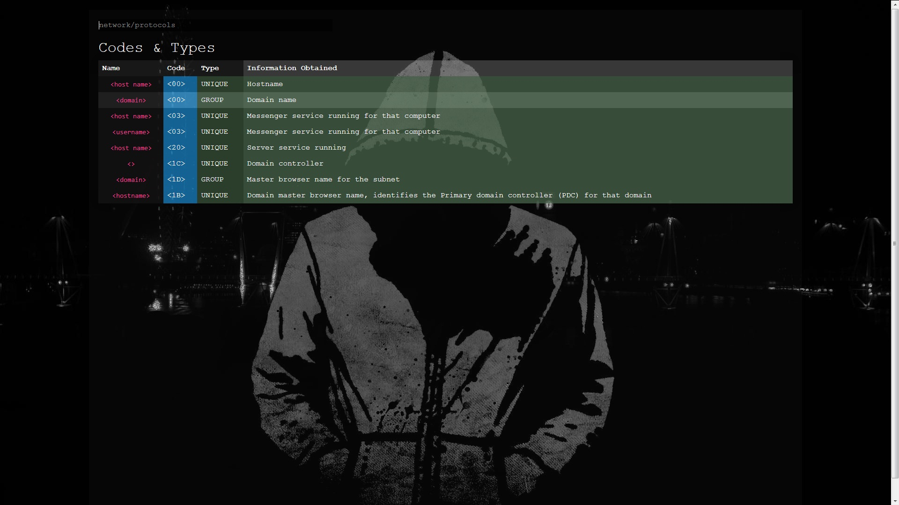

# Jotebook

This is a small app I developed for personal use. I started to use it everyday so I tought to share it. This is a work in progress and not a stable version. I am adding features while I am using it and my needs growing up.
This application is useful if you want to store data to a structured way to reutilize them and, at the same time, be able to browse them.

### How it works > Long story short

You write data in the "papers" (json files structured with Jotebook rules). Jotebook parses the folder where the *papers* are located and then you can browse your *papers* through a web interface.

### Requirements

* PHP 7 up and running on your host machine
* Web Browser

### First installation

- Once you downloaded the repo on your computer, copy the root folder in your web directory and name it: "Jotebook"
- Visit the page http://localhost/Jotebook/?p=refresh to init your first installation
- Now, your first installation is completed you can start to use the notebook
- You can customize your settings in ProjectFolder/config/application.php file

### First Usage
- Once you installed it, you can start to make your own papers. Continue to read to learn how to write *papers*.

### Sample Project - (included in the repo)



Into the repo I included a paper of example and it is supposed to be a notebook for hacking.
In this notebook we have just one paper (one json file, located in ApplicationFolder/papers). You can found it [here](papers/Enumeration.json)

 ## The paper 
 
```json
{
  "canonicals":[],
  "info": {},
  "index": {},
  "paragraphs": {}
}
```

This is the basic structure of a *paper* in Jotebook.

## Canonical - The paper

Canonicals field contains the url that points to that specific paper.

```"canonicals":["enumeration","hacking/enumeration"],```

You can try to visit http://localhost/Jotebook/?p=hacking%2Fenumeration or http://localhost/Jotebook/?p=enumeration
and you will be redirected to the index of the Enumeration Paper.


## Index - The paper

This page elaborates the index json array into the requested paper file.

```json
 "index":
 {
	"netbios": 
	{
		"type": "section",
		"name": "Netbios",
		"paragraphs":
		{
			"codes": 
			{
				"type": "ref",
				"link": "netbios-codes",
				"name": "Codes",
				"href": "enumeration/netbios/codes"
			},
			"ports": 
			{
				"type": "ref",
				"link": "netbios-ports",
				"name": "Ports",
				"href": "enumeration/netbios/ports"
			},
			"tools":
			{
				"type":"section",
				"name": "Tools",
				"paragraphs":
				{
					"nbtstat":
					{
						"type": "ref",
						"link": "nbtstat",
						"name": "Nbtstat",
						"href": "enumeration/netbios/tool"
					},
					"tools-list":
					{
						"type": "ref",
						"link": "tools-list",
						"name": "List",
						"href": "enumeration/netbios/tools"
					}
				}
			}
		}
	}
 },
 ```
 
 Into the index array you can specify 2 different objects: ref and section.

## Section - The paper

```json
	"section-name": 
	{
		"type": "section",
		"name": "Section Title",
		"paragraphs":
		{
			
		}
	}
```
