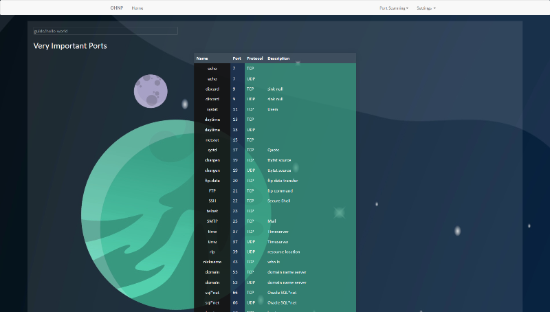

# Jotebook

This application is useful if you need to have a dynamic notebook to be able to write pages composed by notes that can be then browsed singularly for quick reference.

> This is an application I developed for personal use. I started to use it everyday so I tought to share it. This is a work in progress and not a stable version. I am adding features while I am using it and my needs growing up. **The code is very ugly.** I mean, it has been wrote in the optic to be immediately usable by me and to be wrote again in a second time. So, don't judge my ability to write code by this project.


# Features Intro

### Dynamic Index

Don't lose time to order files in folder, just put the category name in each paper you make and a dynamic index will permit you to browse your notes.

> Here the index of a sample (hacking) jotebook.


Insert notes in your paper and an index will be generated to permit you to browse arguments in paper.

> Here the index of the paper "Port Scanning" generated automatically 


If you like to have all in order you can specify a custom index for your paper and browse arguments in it following your logic.

> Here the index of the paper "Enumeration" generated by specifics


### Dynamic Tables

Don't lose time to write HTML to store your data in table. Use the object "table" in your paper when you want to order data in tables.

> Here a generated table



Give to your notes a link, or more than one, that you can easily remember. In this example, we can have access to the table that stores the commands of the protocol SMTP in the link:  `protocols/smtp/commands`

> Here searching for the table protocols/smtp/commands


> Here the content of the table protocols/smtp/commands


### Flashcards

Use the plugin **flashcards** on a table page to use the data stored in the table to generate dynamic flashcards to help you to repeat.

### Argument Menu Index

If you are watching a table or something else and you need more resources about that you can use the Argument Menu Index on the top to browse other subjects of the argument.

> Here the Argument Menu Index of the protocols/smtp/commands table


### Wiki Pages

Using the Jotebook functions in your wiki pages you will be able to write pages wikipedia style. You can call in your page your notes, like tables, dynamically.

> Here the wiki page of the SMTP Protocol. As you can see has been called the table protocols/smtp/commands in the page, dynamically, of course.


### Templates for Wiki Pages

Save time using the function templates. Define your template and use it. In this example I made the protocol template that shows the common elements for each protocol such as ports, OSI layer, description and so on....

> Here the gray section is the html generated by the protocol template. You are watching the LDAP paper.


### Wiki Shots

As you can have access to tables calling them using their links (do you remember the protocols/smtp/commands table? ) you can have access to HTML pieces of code. In this example we have access to a sophisticated table using the link protocols/icmp/messages.


### Themes

You can use the default theme or you can make a your own template. 

### Dev::Features  

> Version 0.0.6-dev
 1. Dynamic Tables
 2. MarkedDown Full support
 3. Dynamic Index
 4. Custom Themes
 5. Dynamic Pages
 6. Quick reference trhough search bar

> Coming Soon
 1. Dynamic Glossary
 2. Plugins Support
   .a Dynamic Flashcards from tables
   .b DataTables

> In queue
  - Multi Jotebook switch 
  - Jotebook GUI editor

## Wiki

https://github.com/TheoRelativity/Jotebook/wiki

### Requirements

* PHP 7 up and running on your host machine
* Web Browser

### First Installation

1. Download or clone this repo in your computer. 
2. Copy the Jotebook Root folder into your web server directory. Rename the directory from Jotebook-master to Jotebook.
3. Make a new folder where you prefer into your computer. Copy its location.
   For semplicity, I assume you made a folder somewhere called "papers".
4. Open with a text editor the application.php file in Jotebook/config folder
5. Find the line
```php
/*
  * Folder that contains the Jotebook's folders.
*/
define("DATA_DIRECTORY","");
```
6. Paste the location of the papers directory in your desktop. Remember to **NOT** add the directory separator at the end. 
   You should see something like this one.
```php
/*
  * Folder that contains the Jotebook's folders.
*/
define("DATA_DIRECTORY","somewhere/papers");
```
7. Cut/copy the folder called "jotebook_example" into your "papers" directory.
8. Open your browser. Visit the page: http://localhost/Jotebook
9. Ignore errors if they appear. Click on JB Settings and then on update.
10. First installation finished. If you see errors controls all the steps again.

